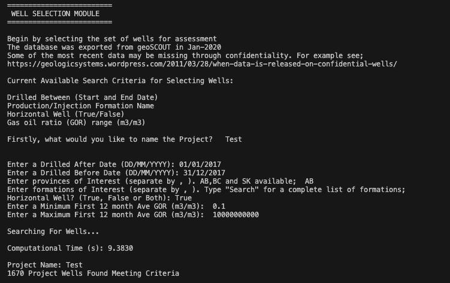

# Canadian-Oilfield-Envrionmental-Assessor
Repository for the Canadian Oilfield Environmental Assessor (COEA) tool

# Acknowledgment
This Version of the COEA tool is created based on the original tool created by Alex Bradley in 2020.

# Datasets 
The COEA tool relies on several datasets describing several activities of the upstream Canadian O&G industry. 

The Project Data can be downloaded and unzipped from here - https://drive.google.com/file/d/17g927s3yLod_ujxeNGZtKvLEfnrX6hYj/view?usp=sharing

Additonal project data and reports that may be of use can be found here - https://drive.google.com/drive/folders/1-kXnw8VZBgOziqi7pjq4OuPjRuDqKCF-?usp=sharing

Alex Bradley's Research Paper - http://hdl.handle.net/1880/111763

# Overview
COEA originally required python 2.7, it is now updated to run on Python 3 (tested on Python 3.12). The environment is best setup using a package management tool such as conda. The *coea_gui.py* is the main script to run the tool. This will run the tools Graphical User Interface (GUI) were you can provide your inputs, then click on the *submit* button. The tool will then call various functions from the runfiles folder, ultimately exporting results to a version of the OPGEE tool where emissions intensities can be estimated. The analysis is completed based on the selection of a set of wells. The following image shows some default parameters that can be used for testing.



# Setup
1. Install conda miniforge on local machine (https://github.com/conda-forge/miniforge). Existing conda install should also work. 
2. Create the enviornment ```conda env create -f environment.yml```
3. Install the following required libraries while the conda environemnt is active, ...
4. Edit the file *runfiles/map_to_drive.py* to point to the folder containing the unzipped 'Project Data' file downloaded from the above link. 
5. Run the script ```python Canadian_Oilfield_Environmental_Assessor.py```

# Contact
Reach out to kareim.youssef@ucalgary.ca or alexbradley60@gmail.com
